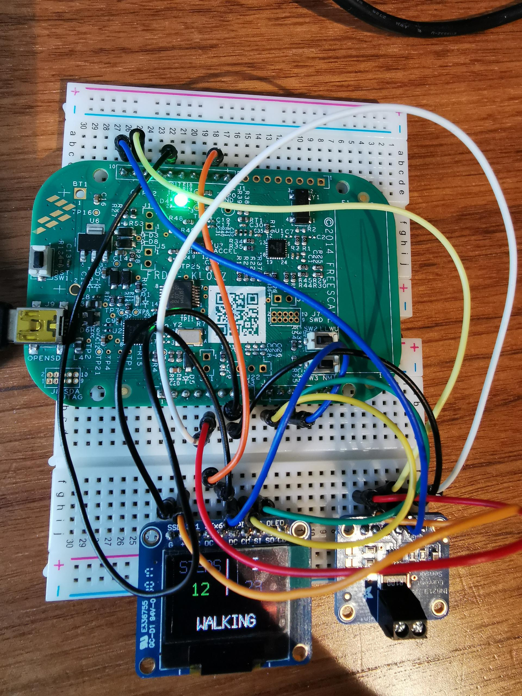

# Pedometer Activity Classifier
**Name: Eeshta Suresh
CRSID: es832 
College: Girton College Cambridge**

To access the project visit: https://github.com/eeshta/Warp-firmware

## Motivation
According to the World Obesity Federation, 51% of the world will be obese or overweight within the next 12 years. Obesity carries with it significantly higher risks for developing diabetes, hypertension, stroke, and respiratory problems. To prevent obesity, most public health guidelines recommend that adults participate in 30 minutes of moderate intensity physical activity on most days of the week. Research suggests that  pedometer readings usually serve as a motivational factor for physical activity behavior change. This is due to performance accomplishment that pedometers can facilitate. 

## Project Summary
A smart pedometer that can display the step count, measure speed, the number of calories burnt, and keep track of the user's BMI index. This device can also classify if the user is resting, walking or running. Furthermore, the device has also been optimised for low power consumption when at rest. Lastly, the device can calculate and output the confidence level (as a percentage) of the current activity classification using statistical analysis. 

In order to get a accurate value for step count, the x,y and z axis accelerometer data is first stored in a data buffer. This is passed through a low pass FIR filter, followed by differentiation. If the steps in buffer is greater than the running threshold (=8), then the user is running. If there is no steps in the the buffer in a given time frame, the user is at rest. ELse, the user is walking.  Finally, checks are carried out by the function to ensure that there are no steps in the last buffer period. Finally, statistics is used determine if it corresponds to actual walking, running or noise. 




# Baseline firmware for the [Warp](https://github.com/physical-computation/Warp-hardware) family of hardware platforms
This is the firmware for the [Warp hardware](https://github.com/physical-computation/Warp-hardware) and its publicly available and unpublished derivatives. This firmware also runs on the Freescale/NXP FRDM KL03 evaluation board which we use for teaching at the University of Cambridge. When running on platforms other than Warp, only the sensors available in the corresponding hardware platform are accessible.

**Prerequisites:** You need an arm cross-compiler such as `arm-none-eabi-gcc` installed as well as a working `cmake` (installed, e.g., via `apt-get` on Linux or via [MacPorts](https://www.macports.org) on macOS). On Ubuntu, the package you need is `gcc-arm-none-eabi`. You will also need an installed copy of the SEGGER [JLink commander](https://www.segger.com/downloads/jlink/), `JlinkExe`, which is available for Linux, macOS, and Windows (here are direct links for downloading it for [macOS](https://www.segger.com/downloads/jlink/JLink_MacOSX.pkg), and [Linux tgz 64-bit](https://www.segger.com/downloads/jlink/JLink_Linux_x86_64.tgz)).

## 1.  Compiling the Warp firmware
First, edit [setup.conf](setup.conf) to set the variable `ARMGCC_DIR` and `JLINKPATH`. If your `arm-none-eabi-gcc` is in `/usr/local/bin/arm-none-eabi-gcc`, then you want to set  `ARMGCC_DIR` to `/usr/local`. In the following, this `README.md` will refer to the top of the repository as `$TREEROOT`. On some platforms, you might need to also, in addition, set the `ARMGCC_DIR` environment variable in your shell (using `setenv` or `export` as appropriate), to point to the same path as you set in [setup.conf](setup.conf).

Second, edit [`tools/scripts/glaux.jlink.commands`](tools/scripts/glaux.jlink.commands) and [`tools/scripts/warp.jlink.commands`](tools/scripts/warp.jlink.commands) to replace `<full-path-to-warp-firmware>` with the full path to your Warp firmware directory.

Third, build the Warp firmware by

	make warp

Fourth, load the Warp firmware to hardware by

	make load-warp

To build for the Glaux variant, use `make glaux` and `make load-glaux` in steps three and four instead.

The build process copies files from `src/boot/ksdk1.1.0/` into the `build/`, builds, and converts the binary to SREC. See `Warp/src/boot/ksdk1.1.0/README.md` for more. _When editing source, edit the files in `src/boot/ksdk1.1.0/`, not the files in `build` location, since the latter are overwritten during each build._

To connect to the running hardware to see output, you will need two terminal windows. In a separate shell window from the one in which you ran `make load-warp` (or its variants), launch the JLink RTT client<sup>&nbsp;<a href="#Notes">See note 1 below</a></sup>:

	JLinkRTTClient

## 2. Using the Warp firmware on the Freescale FRDMKL03 Board
The SEGGER firmware allows you to use SEGGER’s JLink software to load your own firmware to the board, even without using their specialized JLink programming cables. You can find the SEGGER firmware at the SEGGER Page for [OpenSDA firmware](https://www.segger.com/products/debug-probes/j-link/models/other-j-links/opensda-sda-v2/).

To build the Warp firmware for the FRDM KL03, you will need to modify [this line in `src/boot/ksdk1.1.0/config.h`](https://github.com/physical-computation/Warp-firmware/blob/9e7f9e5e3f3c039cc98cbd1e6dfeb6b8fd78c86a/src/boot/ksdk1.1.0/config.h#L55).


## 3.  Editing the firmware
The firmware is currently all in `src/boot/ksdk1.1.0/`, in particular, see `src/boot/ksdk1.1.0/warp-kl03-ksdk1.1-boot.c` and the per-sensor drivers in `src/boot/ksdk1.1.0/dev*.[c,h]`.

The firmware builds on the Kinetis SDK. You can find more documentation on the Kinetis SDK in the document [doc/Kinetis SDK v.1.1 API Reference Manual.pdf](https://github.com/physical-computation/Warp-firmware/blob/master/doc/Kinetis%20SDK%20v.1.1%20API%20Reference%20Manual.pdf).

The firmware is designed for the Warp and Glaux hardware platforms, but will also run on the Freescale FRDM KL03 development board. In that case, the only sensor driver which is relevant is the one for the MMA8451Q. For more details about the structure of the firmware, see [src/boot/ksdk1.1.0/README.md](src/boot/ksdk1.1.0/README.md).

## 4.  To update your fork
From your local clone:

	git remote add upstream https://github.com/physical-computation/Warp-firmware.git
	git fetch upstream
	git pull upstream master


### 5. Pin configuration
Pin configuration from FRDM KL03 to SSD1331 OLED display. 
```
BOARD		DISPLAY
5V-5	->	VCC
GND-7   ->	GND
PTA8	->	MOSI
PTA9	->	SCK
PTB11	->	OC
PTA12	->	DC
PTB0	->	R

```

Pin configuration from INA219 to display. 
```
INA219		DISPLAY/BOARD
VCC	->	5V-5	 
GND   	->	GND-7	 
SCL	->	PTB3	  
SDA	->	PTB4
VIN-	->	+
VIN+	->	5V-5

```

The MMA8451Q built in to the KL03 evaluation board is used to record accelerations and is interfaced by i2c.

## Source File Descriptions
The main is in `src/boot/ksdk1.1.0/boot.c`. Functions for the step counting, BMI index, calorie monitor, distance and speed measurement functions are contained within `src/boot/ksdk1.1.0/pedometer.c`. The drivers for the display are in `src/boot/ksdk1.1.0/devSSD1331.c` and for the MMA8541Q in `src/boot/ksdk1.1.0/devMMA8451Q.c`. 

The section below briefly describes all the relevant source files in the `src/boot/ksdk1.1.0/` directory. In order to toggle between the different display modes, change the setting parameter in line 1890 of `src/boot/ksdk1.1.0/boot.c` to 1 (Calories), 2 (Distance), 3 (Speed) or 4 (BMI).

##### `CMakeLists-Warp.txt`
This is the CMake configuration file. Edit this to change the default size of the stack and heap.

##### `SEGGER_RTT.*`
This is the implementation of the SEGGER Real-Time Terminal interface. Do not modify.

##### `SEGGER_RTT_Conf.h`
Configuration file for SEGGER Real-Time Terminal interface. You can increase the size of `BUFFER_SIZE_UP` to reduce text in the menu being trimmed.

##### `SEGGER_RTT_printf.c`
Implementation of the SEGGER Real-Time Terminal interface formatted I/O routines. Do not modify.

##### `devSSD1331.*`
Driver for the SSD1331 OLED display.

##### `devMMA8451Q.*`
Driver for the MMA8451Q 3-axis accelerometer sensor.

##### `gpio_pins.c`
Definition of I/O pin configurations using the KSDK `gpio_output_pin_user_config_t` structure.

##### `gpio_pins.h`
Definition of I/O pin mappings and aliases for different I/O pins to symbolic names relevant to the Warp hardware design, via `GPIO_MAKE_PIN()`.

##### `startup_MKL03Z4.S`
Initialization assembler.

##### `boot.c`
Main program including initialisation and while loops which runs the program continously. The while loop runs automatically on start-up after initialisation.

##### `pedometer.c`
Implementation of functions used by pedometer that is called inside the main loop. It containes functions to calculate step counts, distance, speed, BMI and current activity mode.

##### `pedometer.h`
Constant and data structure definitions for pedometer.c

##### `warp.h`
Constant and data structure definitions.
----

### If you use Warp in your research, please cite it as:
Phillip Stanley-Marbell and Martin Rinard. “A Hardware Platform for Efficient Multi-Modal Sensing with Adaptive Approximation”. ArXiv e-prints (2018). arXiv:1804.09241.

**BibTeX:**
```
@ARTICLE{1804.09241,
	author = {Stanley-Marbell, Phillip and Rinard, Martin},
	title = {A Hardware Platform for Efficient Multi-Modal 
	Sensing with Adaptive Approximation},
	journal = {ArXiv e-prints},
	archivePrefix = {arXiv},
	eprint = {1804.09241},
	year = 2018,
}
```
Phillip Stanley-Marbell and Martin Rinard. “Warp: A Hardware Platform for Efficient Multi-Modal Sensing with Adaptive Approximation”. IEEE Micro, Volume 40 , Issue 1 , Jan.-Feb. 2020.

**BibTeX:**
```
@ARTICLE{8959350,
	author = {P. {Stanley-Marbell} and M. {Rinard}},
	title = {Warp: A Hardware Platform for Efficient Multi-Modal
	Sensing with Adaptive Approximation},
	journal = {IEEE Micro},
	year = {2020},
	volume = {40},
	number = {1},
	pages = {57-66},
	ISSN = {1937-4143},
	month = {Jan},
}
```
### Acknowledgements
This research is supported by an Alan Turing Institute award TU/B/000096 under EPSRC grant EP/N510129/1, by Royal Society grant RG170136, and by EPSRC grants EP/P001246/1 and EP/R022534/1.

----
### Notes
<sup>1</sup>&nbsp; On some Unix platforms, the `JLinkRTTClient` has a double echo of characters you type in. You can prevent this by configuring your terminal program to not echo the characters you type. To achieve this on `bash`, use `stty -echo` from the terminal. Alternatively, rather than using the `JLinkRTTClient`, you can use a `telnet` program: `telnet localhost 19021`. This avoids the JLink RTT Client's "double echo" behavior but you will then need a carriage return (&crarr;) for your input to be sent to the board. Also see [Python SEGGER RTT library from Square, Inc.](https://github.com/square/pylink/blob/master/examples/rtt.py) (thanks to [Thomas Garry](https://github.com/tidge27) for the pointer).
